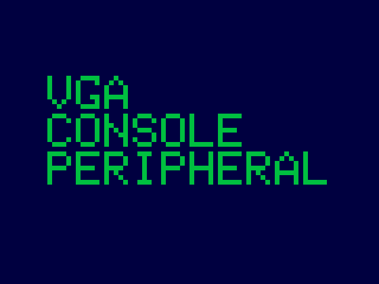

<!---

This file is used to generate your project datasheet. Please fill in the information below and delete any unused
sections.

The peripheral index is the number TinyQV will use to select your peripheral.  You will pick a free
slot when raising the pull request against the main TinyQV repository, and can fill this in then.  You
also need to set this value as the PERIPHERAL_NUM in your test script.

You can also include images in this folder and reference them in the markdown. Each image must be less than
512 kb in size, and the combined size of all images must be less than 1 MB.
-->

# VGA character console

Author: Ciro Cattuto

Peripheral index: nn

## What it does

The peripheral provides a 10x3 character VGA console supporting printable ASCII characters (32-126). The 10x3 text buffer is memory-mapped, hence it is possible to set individual characters using simple writes to the peripheral's registers. Non-printable ASCII codes are displayed as a filled block. The peripheral triggers the user interrupt once per frame refresh. The peripheral generates a 1024x768 60Hz CVT signal for the [TinyVGA PMOD](https://github.com/mole99/tiny-vga).

## Register map

- The 10x3 character buffer is exposed via registers `CHAR0` to `CHAR29`. Writing a byte to any of these registers sets the ASCII code of the corresponding character (bit 7 of the written byte is ignored). The character is displayed in the default color (green).
- Writing a half-word or word to any of the character registers sets the ASCII code (lowest 7 bits) and the color of the character (bits 8 and 9). Selectable colos are: green (00), yellow (01), teal (10), magenta (11).
- Reading the VGA register clears the interrupt flag

| Address | Name   | Access | Description                                                         |
|---------|--------|--------|---------------------------------------------------------------------|
| 0x00    | CHAR0  | W    | ASCII code + color of character at position 0                         |
| 0x01    | CHAR1  | W    | ASCII code + color of character at position 1                         |
| 0x02    | CHAR2  | W    | ASCII code + color of character at position 2                         |
| ...     | ...    | W    | ...                                                                   |
| 0x1B    | CHAR27 | W    | ASCII code + color of character at position 27                        |
| 0x1C    | CHAR28 | W    | ASCII code + color of character at position 28                        |
| 0x1D    | CHAR29 | W    | ASCII code + color of character at position 29                        |
| 0x3F    | VGA    | R    | VGA status: clear interrupt on read                                   |         

## How to test

Write 65 to register CHAR0. A green "A" character should appear at the top left of the VGA display.

## External hardware

[TinyVGA PMOD](https://github.com/mole99/tiny-vga) for VGA output.

